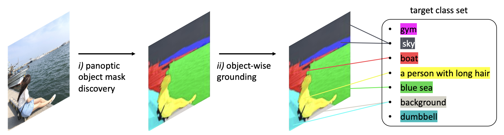

<div align="center">
  <h1> In Defense of Lazy Visual Grounding for Open-Vocabulary Semantic Segmentation </h1>
</div>


<div align="center">
  <h3><a href=http://dahyun-kang.github.io>Dahyun Kang</a> &nbsp;&nbsp;&nbsp;&nbsp; <a href=http://cvlab.postech.ac.kr/~mcho/>Minsu Cho</a></h3>
</div>
<br />


<div align="center">
  <a href="https://arxiv.org/abs/2408.04961"></a>
  <a href="http://cvlab.postech.ac.kr/research/lazygrounding"></a>
</div>
<br />

<div align="center">
  
</div>

This repo is the official implementation of the ECCV 2024 paper [In Defense of Lazy Visual Grounding for Open-Vocabulary Semantic Segmentation](https://arxiv.org/pdf/2408.04961)


## Conda installation command
```bash
conda env create -f environment.yml --prefix $YOURPREFIX
```
`$YOUPREFIX` is typically `/home/$USER/anaconda3`


## Dependencies

This repo is built on [CLIP](https://github.com/openai/CLIP), [SCLIP](https://github.com/wangf3014/SCLIP), and [MMSegmentation](https://github.com/open-mmlab/mmsegmentation). 

```
mim install mmcv==2.0.1 mmengine==0.8.4 mmsegmentation==1.1.1
pip install ftfy regex yapf==0.40.1
```


## Dataset preparation
Please make it compatible with Pascal VOC 2012, Pascal Context, COCO stuff 164K, COCO object, ADEChallengeData2016, and Cityscapes following the [MMSeg data preparation](https://github.com/open-mmlab/mmsegmentation/blob/main/docs/en/user_guides/2_dataset_prepare.md).
The COCO-Object dataset can be converted from COCO-Stuff164k by executing the following command:

```
python datasets/cvt_coco_object.py PATH_TO_COCO_STUFF164K -o PATH_TO_COCO164K
```

Place them under `$yourdatasetroot/` directory such that:
```
    $yourdatasetroot/
    ├── ADEChallengeData2016/
    │   ├── annotations/
    │   ├── images/
    │   ├── ...
    ├── VOC2012/
    │   ├── Annotations/
    │   ├── JPEGImages/
    │   ├── ...
    ├── coco_stuff164k/
    │   ├── annotations/
    │   ├── images/
    │   ├── ...
    ├── Cityscapes/
    │   ├── gtFine/
    │   ├── leftImg8bit/
    │   ├── ...
    ├── ...
```


## 1) Panoptic Cut for unsupervised object mask discovery
```bash
cd panoptic_cut
python predict.py \
    --logs panoptic_cut \
    --dataset {coco_object, coco_stuff, ade20k, voc21, voc20, context60, context59, cityscapes} \
    --datasetroot $yourdatasetroot
```

The checkpoints for the panoptic mask discovery is found below google drive:
| mask prediction root after stage 1) | benchmark id                       | Google drive link                                                                                         |
|-------------------------------------|------------------------------------|-----------------------------------------------------------------------------------------------------------|
| coco_stuff164k                      | coco_object, coco_stuff164k        | [link to download (84.5 MB)](https://drive.google.com/file/d/1iEchLAXk6F9bOks-SQ-x6NBZg90xWUQY/view?usp=share_link) |
| VOC2012                             | context59, context60, voc20, voc21 | [link to download (66.7 MB)](https://drive.google.com/file/d/1Y2smJrJX-p4i6NZ0kYe698r2HQ4kUWcM/view?usp=drive_link) |
| ADEChallengeData2016                | ade20k                             | [link to download (29.4 MB)](https://drive.google.com/file/d/17XvE9OOtyaoFqAWbJrUd41nDEbNwAB9F/view?usp=share_link) |
| Cityscapes                          | cityscapes                         | [link to download (23.1 MB)](https://drive.google.com/file/d/1GJ_cNu8syRhteEuW0sTuKF-sQkHnRAaa/view?usp=share_link) |

Place them under `lavg/panoptic_cut/pred/` directory such that:
```
    lavg/panoptic_cut/pred/panoptic_cut/
    ├── ADEChallengeData2016/
    │   ├── ADE_val_00000001.pth
    │   ├── ADE_val_00000002.pth
    │   ├── ...
    ├── VOC2012/
    │   ├── 2007_000033.pth
    │   ├── 2007_000042.pth
    │   ├── ...
    ├── coco_stuff164k/
    │   ├── 000000000139.pth
    │   ├── 000000000285.pth
    │   ├── ...
    ├── Cityscapes/
    │   ├── frankfurt_000000_000294_leftImg8bit.pth
    │   ├── ...
```


## 2) Visual grounding & Segmentation evaluation
Update `$yourdatasetroot` in `configs/cfg_*.py`

```bash
cd lavg
python eval.py --config ./configs/{cfg_context59/cfg_context60/cfg_voc20/cfg_voc21}.py --maskpred_root VOC2012/panoptic_cut
python eval.py --config ./configs/cfg_ade20k.py --maskpred_root ADEChallengeData2016/panoptic_cut
python eval.py --config ./configs/{cfg_coco_object/cfg_coco_stuff164k}.py --maskpred_root coco_stuff164k/panoptic_cut
python eval.py --config ./configs/cfg_city_scapes.py --maskpred_root Cityscapes/panoptic_cut
```
The run is a single-GPU compatible.


## Quantitative performance (mIoU, \%) on open-vocabulary semantic segmentation benchmarks

<table>
  <tr>
    <td></td>
    <td colspan="3" align="center"><strong>With background category</strong></td>
    <td colspan="5" align="center"><strong>Without background category</strong></td>
  </tr>
  <tr>
    <td align="left">Method</td>
    <td align="center">VOC21</td>
    <td align="center">Context60</td>
    <td align="center">COCO-obj</td>
    <td align="center">VOC20</td>
    <td align="center">Context59</td>
    <td align="center">ADE</td>
    <td align="center">COCO-stuff</td>
    <td align="center">Cityscapes</td>
  </tr>
  <tr>
    <td align="left">LaVG</td>
    <td align="center">62.1</td>
    <td align="center">31.6</td>
    <td align="center">34.2</td>
    <td align="center">82.5</td>
    <td align="center">34.7</td>
    <td align="center">15.8</td>
    <td align="center">23.2</td>
    <td align="center">26.2</td>
  </tr>
</table>

      
## Related repos
Our project refers to and heavily borrows some the codes from the following repos:

* [[SCLIP]](https://github.com/wangf3014/SCLIP)
* [[CutLER]](https://github.com/facebookresearch/CutLER)


## Acknowledgements
This work was supported by Samsung Electronics (IO201208-07822-01), the NRF grant (NRF-2021R1A2C3012728 (45%), and the IITP grants (RS-2022-II220959: Few-Shot Learning of Causal Inference in Vision and Language for Decision Making (50%), RS-2019-II191906: AI Graduate School Program at POSTECH (5%)) funded by Ministry of Science and ICT, Korea.
We also thank [Sua Choi](https://github.com/sua-choi) for her helpful discussion.
